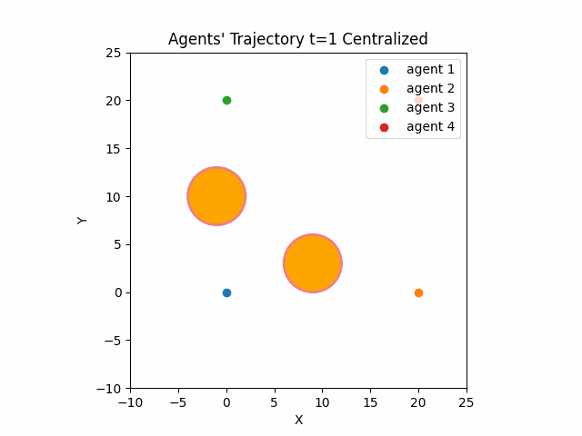
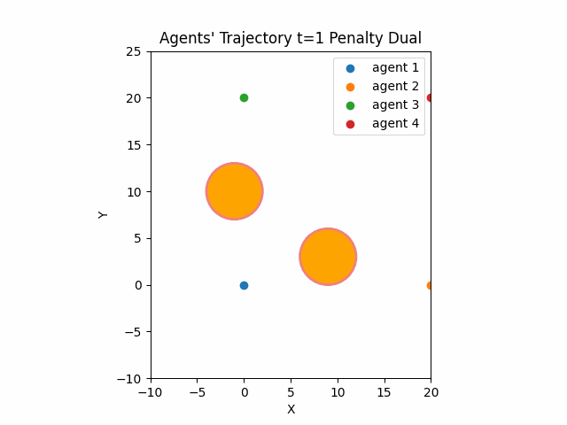
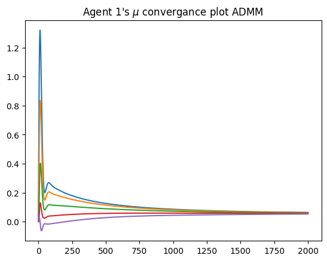

This folder contains ('.ipynb') files for the distributed project.

This project aims to let agents reach a consensus on where to take a pre-determined formation while avoiding obstacles. This is an optimal control problem as the acceleration inputs should also be minimal. We use [penalty dual](https://books.google.com/books?hl=en&lr=&id=MVngCQAAQBAJ&oi=fnd&pg=PP7&dq=Distributed+Optimization-Based+Control+of+Multi%3FAgent+Networks+in+Complex+Environments&ots=2eZv-v9Azp&sig=KpQ_7E9bFEtZGwoFB8PgfjZvnwE#v=onepage&q=Distributed%20Optimization-Based%20Control%20of%20Multi%3FAgent%20Networks%20in%20Complex%20Environments&f=false) and [ADMM](https://web.stanford.edu/~boyd/papers/pdf/admm_distr_stats.pdf) distributed optimization without any coordinator so the agents fuse their data via a communication graph a centralized method is also available. The simulation is done using four agents and two obstacles.

## Results

 &nbsp; &nbsp;
 &nbsp; &nbsp;
 &nbsp; &nbsp;

